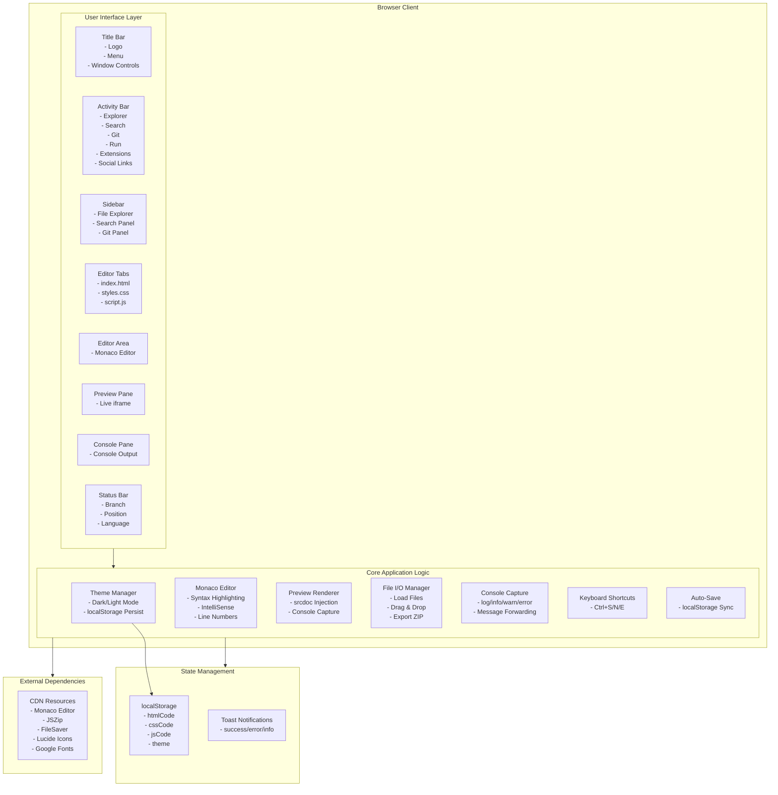

# Code Studio – HTML, CSS & JS Playground

> A powerful, browser-based code editor for building and testing HTML, CSS, and JavaScript in real-time. Built with React, TypeScript, and Monaco Editor. Features live preview, console output, dark/light themes, and export capabilities.

---


---

## System Architecture



---

## Features

### Core Features
- **Real-time Live Preview** – Instantly see HTML/CSS/JS changes as you type
- **Monaco Editor** – VS Code's editor with syntax highlighting and IntelliSense
- **Console Output** – Captures console.log, info, warn, and error messages
- **Dark/Light Theme** – Toggle between themes with system persistence
- **File Operations** – Load .html, .css, .js files via button or drag & drop
- **One-click Export** – Download project as ZIP (index.html, styles.css, script.js)
- **Multiple Editor Tabs** – Switch between HTML, CSS, and JavaScript files
- **Keyboard Shortcuts** – Ctrl+S (save), Ctrl+N (new), Ctrl+E (export)
- **Auto-save** – Changes automatically saved to localStorage

### UI/UX Features
- **VS Code-style Layout** – Activity bar, sidebar, editor, preview, console panes
- **Status Bar** – Shows line/column position, language, encoding
- **Resizable Panels** – Drag to resize preview and console
- **Toast Notifications** – Success/error feedback messages
- **Social Media Links** – GitHub, LinkedIn, Instagram, CodePen, website

### Developer Features
- **TypeScript Support** – Full type safety
- **Hot Module Replacement** – Fast development with Vite
- **Responsive Design** – Adapts to different screen sizes

---

## Development Stack

| Category | Technology | Version |
|----------|------------|---------|
| **Framework** | React | 18.2.0 |
| **Language** | TypeScript | 5.3.3 |
| **Build Tool** | Vite | 5.0.12 |
| **Code Editor** | Monaco Editor | 0.45.0 |
| **Icons** | Lucide React | 0.312.0 |
| **Fonts** | Inter, JetBrains Mono | Google Fonts |
| **Export** | JSZip, FileSaver | 3.10.1, 2.0.5 |

---

## Getting Started

### Prerequisites
- Node.js 18+ 
- npm or yarn

### Installation
```bash
# Clone the repository
git clone https://github.com/girishlade111/VS-Code-Studio.git
cd VS-Code-Studio

# Install dependencies
npm install

# Start development server
npm run dev
```

### Build for Production
```bash
npm run build
```

### Preview Production Build
```bash
npm run preview
```

---

## Usage Instructions

### Loading Files
1. Click the **Open** button in the toolbar, or
2. **Drag and drop** `.html`, `.css`, `.js` files onto the editor

### Switching Editor Tabs
- Click on **index.html**, **styles.css**, or **script.js** tabs
- Or use keyboard shortcuts

### Exporting Project
Click **Export** to download a ZIP file containing:
- `index.html` - Main HTML file
- `styles.css` - CSS styles
- `script.js` - JavaScript code

### Console
- Type JavaScript code in the JS editor
- View console output in the bottom console panel
- Clear console with the trash icon

---

## Project Structure

```
├── public/
│   ├── robots.txt       # Allow all crawlers
│   ├── sitemap.xml    # SEO sitemap
│   ├── favicon.svg   # App icon
│   └── browserconfig.xml
├── src/
│   ├── components/    # React components
│   ├── hooks/       # Custom React hooks
│   ├── types/        # TypeScript interfaces
│   ├── utils/       # Utility functions
│   ├── App.tsx      # Main application
│   ├── App.css      # Component styles
│   ├── index.css    # Global styles
│   └── main.tsx    # Entry point
├── index.html       # HTML template
├── package.json    # Dependencies
├── tsconfig.json  # TypeScript config
├── vite.config.ts  # Vite config
└── README.md      # This file
```

---

## Configuration

### Theme Variables
CSS variables in `:root` and `[data-theme="dark"]`:

| Variable | Light Mode | Dark Mode |
|----------|------------|-----------|
| `--bg` | `#f8f9fc` | `#0d0d12` |
| `--bg-sidebar` | `#ffffff` | `#14141a` |
| `--bg-panel` | `#ffffff` | `#18181f` |
| `--bg-hover` | `#f1f3f8` | `#1f1f2a` |
| `--border` | `#e2e5ed` | `#2a2a38` |
| `--text` | `#1a1a2e` | `#e8e8ed` |
| `--accent` | `#6366f1` | `#818cf8` |

### Monaco Editor Options
- **Font Size**: 14px
- **Font Family**: JetBrains Mono
- **Minimap**: Disabled
- **Line Numbers**: Enabled
- **Tab Size**: 2
- **Word Wrap**: Enabled

### Local Storage Keys
| Key | Description |
|-----|-------------|
| `theme` | `"dark"` or `"light"` |
| `htmlCode` | HTML editor content |
| `cssCode` | CSS editor content |
| `jsCode` | JavaScript editor content |

---

## Keyboard Shortcuts

| Shortcut | Action |
|----------|--------|
| `Ctrl + S` | Save project |
| `Ctrl + N` | New project |
| `Ctrl + E` | Export ZIP |

---

## SEO Configuration

### Meta Tags
- **Open Graph** – For social media sharing
- **Twitter Cards** – For Twitter previews
- **Geo Tags** – Location metadata
- **Canonical URL** – Preferred domain

### robots.txt
- Allows all crawlers
- Specifies sitemap location

### sitemap.xml
- Homepage (daily, priority 1.0)
- About/Contact pages (monthly, priority 0.7)

---

## Social Profiles

| Platform | URL |
|----------|-----|
| GitHub | [github.com/girishlade111](https://github.com/girishlade111) |
| LinkedIn | [linkedin.com/in/girish-lade-075bba201](https://www.linkedin.com/in/girish-lade-075bba201/) |
| Instagram | [instagram.com/girish_lade_](https://www.instagram.com/girish_lade_/) |
| CodePen | [codepen.io/Girish-Lade-the-looper](https://codepen.io/Girish-Lade-the-looper) |
| Website | [ladestack.in](https://ladestack.in) |
| Email | admin@ladestack.in |

---

## Browser Compatibility

- **Chrome/Edge** 80+
- **Firefox** 75+
- **Safari** 13+
- **Opera** 66+

> Requires ES6+ and localStorage API support

---

## License

MIT License – Feel free to use, modify, and distribute.

---

## Credits

- [Monaco Editor](https://microsoft.github.io/monaco-editor/) – Code editor
- [React](https://react.dev/) – UI framework
- [Vite](https://vitejs.dev/) – Build tool
- [Lucide](https://lucide.dev/) – Icon library
- [Inter](https://fonts.google.com/specimen/Inter) – Typography
- [JetBrains Mono](https://www.jetbrains.com/lp/mono/) – Code font

---

## Author

**Girish Lade**
- Full Stack Developer
- Nagpur, Maharashtra, India
- Email: admin@ladestack.in
- Website: [ladestack.in](https://ladestack.in)